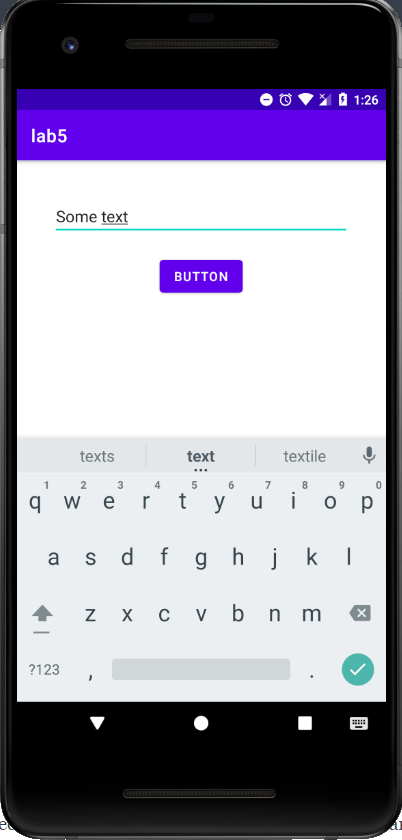
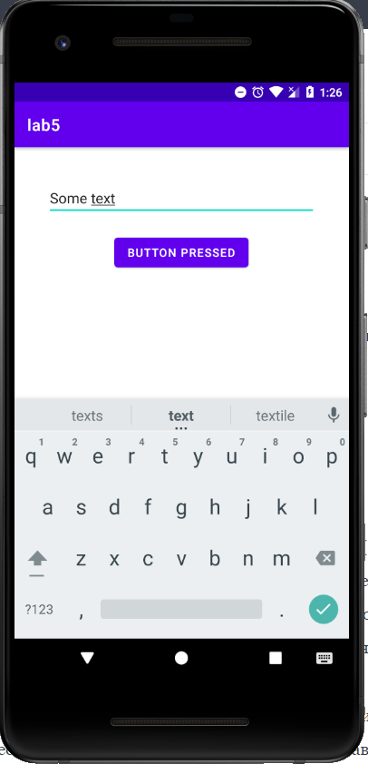
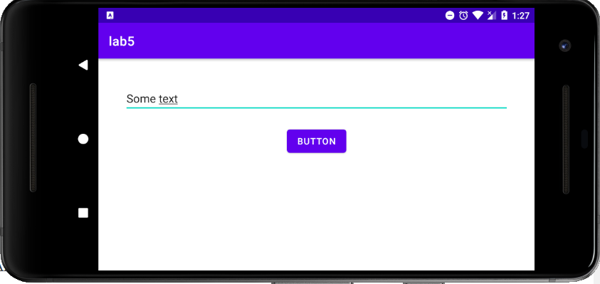

# Лабораторная работа №5. RecyclerView.
## Цели
  - Ознакомиться с принципами и получить практические навыки разработки UI тестов для Android приложений
## Программа работы
#### Задача 1. Простейший UI тест
Разработайте приложение, в котором есть одна кнопка (Button) и одно текстовое поле (EditText). При (первом) нажатии на кнопку текст на кнопке должен меняться. Напишите Espresso тест, который проверяет, что при повороте экрана содержимое текстового поля (каким бы оно ни было) сохраняется, а надпись на кнопке сбрасывается в исходное состояние.

Согласно заданию было создано приложение с необходимой функциональностью и проведено "ручное" тестирование его функциональности. Представленные ниже скриншоты демонстрируют поведение приложения при вводе текста, нажатии на кнопку и повороте экрана.





После изучения материалов по работе с библотекой были написан тест, предственныq ниже:

```
class MainActivityTest {
    @get:Rule
    val activityRule = ActivityScenarioRule(MainActivity::class.java)

    @Test
    fun firstTest() {
        onView(withId(R.id.edit_text)).perform(typeText("Immortal string"))
        onView(withId(R.id.button)).perform(click())

        onView(withId(R.id.edit_text)).check(matches(withText("Immortal string")))
        onView(withId(R.id.button)).check(matches(withText("Button pressed")))

        activityRule.scenario.onActivity { activity ->
            activity.requestedOrientation = ActivityInfo.SCREEN_ORIENTATION_LANDSCAPE
        }

        onView(withId(R.id.button)).check(matches(withText("Button")))
        onView(withId(R.id.edit_text)).check(matches(withText("Immortal string")))
    }
}
```

Средствами библиотеки заполняется поле EditText и производится нажатие кнопки, после чего производится проверка содержимого обоих элементов. Затем, используя код из задания к лабораторной была изменена ориентация устройства и повторно проведены сравнения содержимого элементов с ожидаемыми значениями. Как и предполагалось, поворот экрана устройства вернул текст кнопки в исходное состояние, но не удалил значение, введенное в текстовое поле. 

___

#### Задача 2. Тестирование навигации
Возьмите приложение из Лаб №3 о навигации (любое из решений). Напишите UI тесты, проверяющие навигацию между 4мя исходными Activity/Fragment (1-2-3-About). 

Для тестирования был выбран первый вариант реализации графа навигации между экранами приложения (с использованием startAcivityForResult). После этого был написан ряд тестов:
Первый набор направлен на проверку текущего экрана путем вызова метода isDisplayed к элементам, расположеным на только на конкретном экране.
```
    @Test
    fun isFirst() {
        onView(withId(R.id.to_2_button)).check(matches(isDisplayed()))
    }

    @Test
    fun isSecond() {
        onView(withId(R.id.to_1_button)).check(matches(isDisplayed()))
        onView(withId(R.id.to_3_button)).check(matches(isDisplayed()))
    }

    @Test
    fun isThird() {
        onView(withId(R.id.to_1_from_3)).check(matches(isDisplayed()))
        onView(withId(R.id.to_2_from_3)).check(matches(isDisplayed()))
    }

    @Test
    fun isAbout() {
        onView(withId(R.id.about)).check(matches(isDisplayed()))
    }
```

Второй набор тестов нацелен на проверку перехода между Activity путем нажатия соответствующих кнопок.
```
    @Test
    fun firstToSecond() {
        isFirst()
        onView(withId(R.id.to_2_button)).perform(click())
        isSecond()
    }

    @Test
    fun secondToThird() {
        firstToSecond()
        onView(withId(R.id.to_3_button)).perform(click())
        isThird()
    }

    @Test
    fun thirdToSecond() {
        secondToThird()
        onView(withId(R.id.to_2_from_3)).perform(click())
        isSecond()
    }

    @Test
    fun thirdToFirst() {
        secondToThird()
        onView(withId(R.id.to_1_from_3)).perform(click())
        isFirst()
    }

```

Плюс написан еще один тест, выбирающий случайное число от 1 до 3, переходящий на соответствующий экран и открывающий через options menu активити About.
```
    @Test
    fun toAbout() {
        when ((1..3).shuffled().first()) {
            1 -> isFirst()
            2 -> firstToSecond()
            3 -> secondToThird()
        }

        openActionBarOverflowOrOptionsMenu(getInstrumentation().targetContext)
        onView(withText(R.string.to_about)).perform(click())
        isAbout()
    }
```

Последние 2 теста сделаны для проверки глубины бэкстэка, то есть при нажатии кнопки назад из третьей активити мы должны попасть в первую, а из второй (не зависимо от того, из первой активити мы в нее перешли, или из третьей) - в первую.
```
    @Test
    fun backFromSecond() {
        firstToSecond()
        pressBack()
        isFirst()
        
        thirdToSecond()
        pressBack()
        isFirst()
    }

    @Test
    fun backFromThird() {
        secondToThird()
        pressBack()
        isSecond()
        pressBack()
        isFirst()
    }
```

## Вывод
В ходе выполнения данной лабораторной работы:
   - Изучена библиотека для проведения UI тестов
   - Проведено управление состоянием устройства и отдаельный элементов UI средствами библиотеки
   - Выполнено тестирование изменения состояния элементов при повороте экрана
   - Написаны тесты для тестирования реализованного в третьей лабораторрной работе графа нафигации